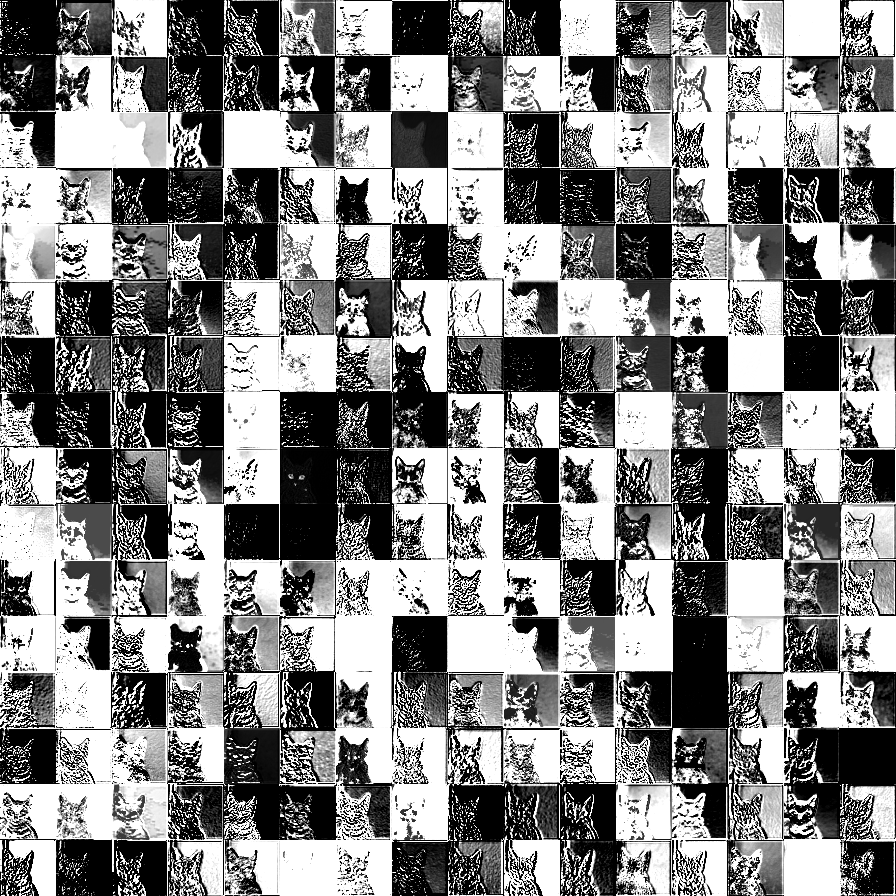
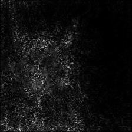
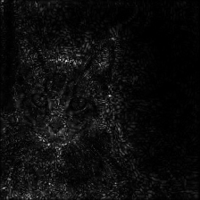
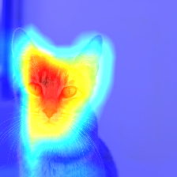
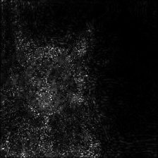
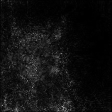

# tf-explain

[](https://pypi.org/project/tf-explain/)
[](https://travis-ci.org/sicara/tf-explain)
[](https://tf-explain.readthedocs.io/en/latest/?badge=latest)


[](https://github.com/python/black)

__tf-explain__ implements interpretability methods as Tensorflow 2.0 callbacks to __ease neural network's understanding__.  
See [Introducing tf-explain, Interpretability for Tensorflow 2.0](https://blog.sicara.com/tf-explain-interpretability-tensorflow-2-9438b5846e35)

__Documentation__: https://tf-explain.readthedocs.io

## Installation

__tf-explain__ is available on PyPi as an alpha release. To install it:

```bash
virtualenv venv -p python3.6
pip install tf-explain
```

tf-explain is compatible with Tensorflow 2. It is not declared as a dependency
to let you choose between CPU and GPU versions. Additionally to the previous install, run:

```bash
# For CPU version
pip install tensorflow==2.0.0
# For GPU version
pip install tensorflow-gpu==2.0.0
```

## Available Methods

1. [Activations Visualization](#activations-visualization)
1. [Vanilla Gradients](#vanilla-gradients)
1. [Gradients*Inputs](#gradients-inputs)
1. [Occlusion Sensitivity](#occlusion-sensitivity)
1. [Grad CAM (Class Activation Maps)](#grad-cam)
1. [SmoothGrad](#smoothgrad)
1. [Integrated Gradients](#integrated-gradients)

### Activations Visualization

> Visualize how a given input comes out of a specific activation layer

```python
from tf_explain.callbacks.activations_visualization import ActivationsVisualizationCallback

model = [...]

callbacks = [
    ActivationsVisualizationCallback(
        validation_data=(x_val, y_val),
        layers_name=["activation_1"],
        output_dir=output_dir,
    ),
]

model.fit(x_train, y_train, batch_size=2, epochs=2, callbacks=callbacks)
```

<p align="center">
    
</p>


### Vanilla Gradients

> Visualize gradients importance on input image

```python
from tf_explain.callbacks.vanilla_gradients import VanillaGradientsCallback

model = [...]

callbacks = [
    VanillaGradientsCallback(
        validation_data=(x_val, y_val),
        class_index=0,
        output_dir=output_dir,
    ),
]

model.fit(x_train, y_train, batch_size=2, epochs=2, callbacks=callbacks)
```

<p align="center">
    
</p>


### Gradients*Inputs

> Variant of [Vanilla Gradients](#vanilla-gradients) ponderating gradients with input values

```python
from tf_explain.callbacks.gradients_inputs import GradientsInputsCallback

model = [...]

callbacks = [
    GradientsInputsCallback(
        validation_data=(x_val, y_val),
        class_index=0,
        output_dir=output_dir,
    ),
]

model.fit(x_train, y_train, batch_size=2, epochs=2, callbacks=callbacks)
```

<p align="center">
    
</p>


### Occlusion Sensitivity

> Visualize how parts of the image affects neural network's confidence by occluding parts iteratively

```python
from tf_explain.callbacks.occlusion_sensitivity import OcclusionSensitivityCallback

model = [...]

callbacks = [
    OcclusionSensitivityCallback(
        validation_data=(x_val, y_val),
        class_index=0,
        patch_size=4,
        output_dir=output_dir,
    ),
]

model.fit(x_train, y_train, batch_size=2, epochs=2, callbacks=callbacks)
```

<div align="center">
    
    <p style="color: grey; font-size:small; width:350px;">Occlusion Sensitivity for Tabby class (stripes differentiate tabby cat from other ImageNet cat classes)</p>
</div>

### Grad CAM

> Visualize how parts of the image affects neural network's output by looking into the activation maps

From [Grad-CAM: Visual Explanations from Deep Networks
via Gradient-based Localization](https://arxiv.org/abs/1610.02391)

```python
from tf_explain.callbacks.grad_cam import GradCAMCallback

model = [...]

callbacks = [
    GradCAMCallback(
        validation_data=(x_val, y_val),
        class_index=0,
        output_dir=output_dir,
    )
]

model.fit(x_train, y_train, batch_size=2, epochs=2, callbacks=callbacks)
```


<p align="center">
    
</p>

### SmoothGrad

> Visualize stabilized gradients on the inputs towards the decision

From [SmoothGrad: removing noise by adding noise](https://arxiv.org/abs/1706.03825)

```python
from tf_explain.callbacks.smoothgrad import SmoothGradCallback

model = [...]

callbacks = [
    SmoothGradCallback(
        validation_data=(x_val, y_val),
        class_index=0,
        num_samples=20,
        noise=1.,
        output_dir=output_dir,
    )
]

model.fit(x_train, y_train, batch_size=2, epochs=2, callbacks=callbacks)
```

<p align="center">
    
</p>

### Integrated Gradients

> Visualize an average of the gradients along the construction of the input towards the decision

From [Axiomatic Attribution for Deep Networks](https://arxiv.org/pdf/1703.01365.pdf)

```python
from tf_explain.callbacks.integrated_gradients import IntegratedGradientsCallback

model = [...]

callbacks = [
    IntegratedGradientsCallback(
        validation_data=(x_val, y_val),
        class_index=0,
        n_steps=20,
        output_dir=output_dir,
    )
]

model.fit(x_train, y_train, batch_size=2, epochs=2, callbacks=callbacks)
```

<p align="center">
    
</p>


## Visualizing the results

When you use the callbacks, the output files are created in the `logs` directory.

You can see them in Tensorboard with the following command: `tensorboard --logdir logs`


## Roadmap

- [ ] Subclassing API Support
- [ ] Additional Methods
  - [ ] [GradCAM++](https://arxiv.org/abs/1710.11063)
  - [x] [Integrated Gradients](https://arxiv.org/abs/1703.01365)
  - [ ] [Guided SmoothGrad](https://arxiv.org/abs/1706.03825)
  - [ ] [LRP](https://journals.plos.org/plosone/article?id=10.1371/journal.pone.0130140)
- [ ] Auto-generated API Documentation & Documentation Testing

## Contributing

To contribute to the project, please read the [dedicated section](./CONTRIBUTING.md).
